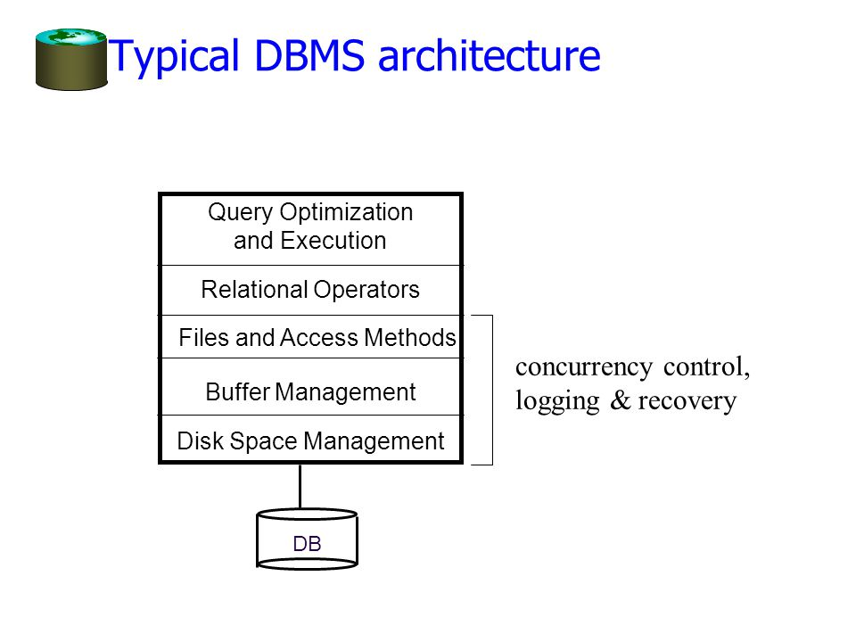

Single-Table Queries

Reading
  - 5.1, 5.2, 12.4.3

SQL and Query Processing
  - Start with single-table queries
  - Basic SQL
  - Query Executor Architecture

Relational Tables
  - Schema is fixed:
    - attribute names, atomic types
    - students(name text, gpa float, dept text)
  - Instance can change
    - a multiset of "rows" ("tuples")
      - {('Bob Snob', 3.3, 'CS'),('Bob Snob', 3.3, 'CS'), ('Mary Contrary', 3.8, 'CS')}

Basic Single-Table Queries
  - Basic Query:
  ```SQL
  SELECT [DISTINCT] <column expression list>
  FROM <single table>
  [WHERE <predicate>]
  [GROUP BY <column list>]
  [HAVING <predicate>]
  [ORDER BY <column list>]
  ```
  - Simplest version is straightforward
    - Produce all tuples in the table that satisfy the predicate
    - Output the expressions in the SELECT list
    - Expression can be a column reference or an arithmetic expression over column refs
  - Distinct flag specifies removal of duplicates before output
  - Order by clause specifies output to be sorted
    - Lexicographic ordering
  - Obviously must refer to columns in the output
    - Note the AS clause for naming output columns!
  - Ascending order by default, but can be overridden
    - DESC flag for descending, ASC for ascending
    - Can mix and match, lexicographically

Aggregates
  - Before producing output compute summary (a.k.a. an aggregate) of some arithmetic expression
  - Produce 1 row of output
  - Other aggregates SUM, COUNT, MAX, MIN
  - Note: can use DISTINCT inside the aggregate function
    - SELECT COUNT(DISTINCT S.name)
    - vs. SELECT DISTINCT COUNT(s.name)

GROUP BY
    - Partition table into groups with same GROUP BY column values
      - Can group by list of columns
    - Produce an aggregate result per group
      - Cardinality of output = # of distinct group values
    - Note: can put grouping columns in SELECT list
      - For aggregate queries, SELECT list can contain aggregate and GROUP BY columns only!
      - What would it mean if we said SELECT S.name, AVG(S.gpa)?
        - Failure

HAVING
  - The HAVING predicate in applied after grouping and aggregation
    - Hence can contain anything that could go in the SELECT list
    - I.e. aggs or GROUP BY columns
  - HAVING can only be used in aggregate queries
  - It's an optional clause

Typical DBMS Architecture


Query Processing Overview
  - The query optimizer translates SQL to a special internal "language"
    - Query Plans
  - The query executor is an interpreter for query plans
  - Think of query plans as "blobs-and-arrows" dataflow diagrams
    - Each blob implements a relational operator
    - Edges represent a flow of tuples(columns as specified)
    - For single-table queries these diagrams are straight line graphs

Iterators
  - The relational operators are all subclasses of the class iterator:
  ```
  class iterator{
    void init();
    tuple next();
    void close();
    iterator &inputs[];
  }
  ```
  - Note:
    - Edges in the graph are specified by inputs (max 2 usually)
    - Encapsulation: any iterator can be input to any other!
    - When subclassing, different iterators will keep different kinds of state information.
