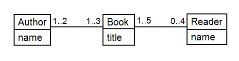
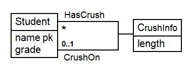
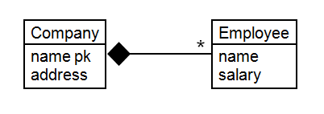
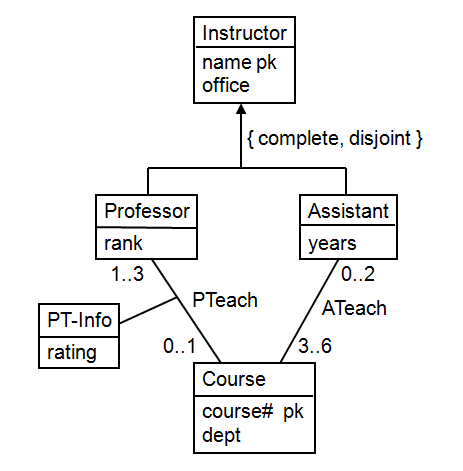

UML Extra Exercises
  - Q1 :  Consider the following UML diagram.
  

    - If there are 6 authors, what's the minimum and maximum number of books? What's the minimum and maximum number of readers?
      - Solution :
      ```
      Books: min 3, max 18
      Readers: min 0, max 72
      ```
    - If there are 6 readers, what's the minimum and maxiumum number of books? What's the minumum and maximum number of authors?
      - Solution :
      ```
      Books: min 2, max infinite
      Authors: min 1, max infinite
      ```

  - Q2 : Consider a tiny social network containing high school students and their "crushes" (desired romantic relationships). Each student may have a crush on at most one other student, and associated with each crush is the length of time the crush has been going on. Students have a name and a grade, and names are unique. Draw a UML diagram that models this information. Make sure to capture the asymmetry and multiplicity of the crush relationship.
    - Solution : (I had a similar answer) Pasting the one given:
    

  - Q3 : Consider a class Book with four subclasses: Anthology, Fiction, Children, and Nonfiction. Is the subclassing relationship overlapping or disjoint (exclusive)? Is it complete or incomplete (partial)?
    - Solution : ```Overlapping and complete```

  - Q4 : Consider the following UML diagram.
  
    - No two companies can have the same name
      - Solution : ```True```
    - No two employees can have the same name
      - Solution : ```False```
    - No two companies can be at the same address
      - Solution : ```False```
    - No two employees can work at the same address
      - Solution : ```False```
    - Each employee works for at least one company
      - Solution : ```True```
    - No employees work for more than one company
      - Solution : ```True```
    - Each company has at least one employee
      - Solution : ```False```
    - Two employees with the same name cannot work for the same company
      - Solution : ```False```
    - Two employees with the same name cannot work for different companies
      - Solution : ```False```

  - Q5 : Consider the following UML diagram.
  
    - ( a ) According to the diagram, what are the minimum and maximum total number of instructors for a given course?
      - Solution :
      ```
      min 1, max 5
      ```
    - ( b ) According to the diagram, what is the minimum and maximum teaching load (number of courses) for professors? For assistants?
      - Solution :
      ```
      Professor : min 0, max 1
      Assistant : min 3, max 6
      ```
    - ( c ) Translate the UML diagram to a relational schema. There are several possible automatic translations; use the translation for subclassing most appropriate for the specified properties as described in the video. If it makes sense to eliminate any association-class relations as described in the video, do so.
      - Solution :
      ```
      Professor(name, office, rank, course#, rating)
      Assistant(name, office, years)
      Course(course#, dept)
      ATeach(name, course#)
      ```
    - ( d ) Specify a minimal key for each relation in your solution to part (c).
      - Solution :
      ```
      Professor(name)
      Assistant(name)
      Course(course#)
      ATeach(name, course#)
      ```
    - ( e ) Suppose by default attribute values cannot contain null. Does your solution to part (c) require any attributes to permit null values?
      - Solution : ```Professor.course# and Professor.rating must allow nulls```
