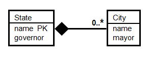
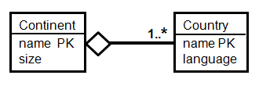
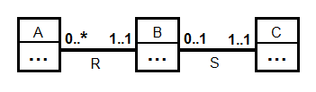

UML Quiz
  - Q1 : Consider translating this UML diagram to relations. Which of the following relations would not be generated by any of the recommended translation schemes discussed in the video?
  
    - A) Edits(name, publisher, ISBN, pub-title, year, start-date, end-date)
    - B) Publication(ISBN, pub-title, year, name, start-date, end-date)
    - C) Publication(ISBN, pub-title, year, volume, edition)
    - D) Book(ISBN, edition)
    - Solution : Edits(name, publisher, ISBN, pub-title, year, start-date, end-date)

  - Q2 : Based on this UML diagram, which of the following statements about Authors is correct?
  
    - A) An author who has written a book has also contributed an article.
    - B) An author may have written nothing.
    - C) An author can write a book or contribute an article, but not both.
    - D) Every author has contributed up to four articles.
    - Solution : An author may have written nothing.

  - Q3 : Based on this UML diagram, which of the following relations best represents articles?
  
    - A) Article(title, pages, keywords, volume, ISBN, pub-title, year)
    - B) Article(title, pages, keywords, ISBN, pub-title, year)
    - C) Article(title, pages, keywords)
    - D) Article(title, pages, keywords, ISBN)
    - Solution : Article(title, pages, keywords, ISBN)

  - Q4 : Consider translating this UML diagram to relations. In the relation Edits generated from the Edits association, which of the following set of underlined attributes is a minimal key?
  
    - A) Edits(<u>name</u>, ISBN, <u>start-date</u>, <u>end-date</u>)
    - B) Edits(name, <u>ISBN</u>, start-date, end-date)
    - C) Edits(<u>name</u>, <u>ISBN</u>, start-date, end-date)
    - D) Edits(<u>name</u>, <u>ISBN</u>, <u>start-date</u>, <u>end-date</u>)
    - Solution : Edits(name, <u>ISBN</u>, start-date, end-date)

  - Q5 : Based on this UML diagram, which of the following statements about the City and State classes is correct?
  
    - A) No two cities can have the same mayor.
    - B) No two states can have the same name.
    - C) No person can be the mayor of cities in two different states.
    - D) No two cities can have the same name.
    - Solution : No two states can have the same name.

  - Q6 : Based on this UML diagram, which of the following statements about the Continent and Country classes is correct?
  
    - A) A continent may have no countries.
    - B) A country can speak two languages.
    - C) Each country must belong to a continent.
    - D) A country may be in no continent.
    - Solution : A country may be in no continent.

  - Q7 : This UML diagram puts some constraints on the cardinalities of classes A, B, and C. Which of the following combinations of cardinalities is permitted? (Note: The cardinality of a class C, denoted |C|, indicates the number of objects in the class.)
  
    - A) |A| = 10; |B| = 0; |C| = 0
    - B) |A| = 10; |B| = 0; |C| = 10
    - C) |A| = 10; |B| = 1; |C| = 10
    - D) |A| = 10; |B| = 20; |C| = 10
    - Solution : |A| = 10; |B| = 1; |C| = 10

  - Q8 : Suppose there is a UML superclass Movies with subclasses. Consider the following possible pairs of subclasses:
  ```
  1. {B,NB}: B = movies in which Kevin Bacon appears; NB = movies in which Kevin Bacon does not appear
  2. {B,R}: B = movies in which Kevin Bacon appears; R = movies in which Julia Roberts appears
  3. {B,K}: B = movies in which Kevin Bacon appears; K = movies in which Val Kilmer appears
  4. {L,S}: L = movies more than 100 minutes long; S = movies less than 105 minutes long
  ```
  - Consider whether each pair of subclasses is complete or incomplete (partial), and whether the pair is overlapping or disjoint (exclusive). (Depending on your knowledge, you may have to do some web searches on movies to get the right classification.) Which of the following statements is correct?
    - A) {B, NB} is complete and disjoint.
    - B) {L, S} is incomplete and disjoint.
    - C) {B, K} is incomplete and overlapping.
    - D) {B, R} is complete and disjoint.
    - Solution : {B, R} is incomplete and overlapping.
